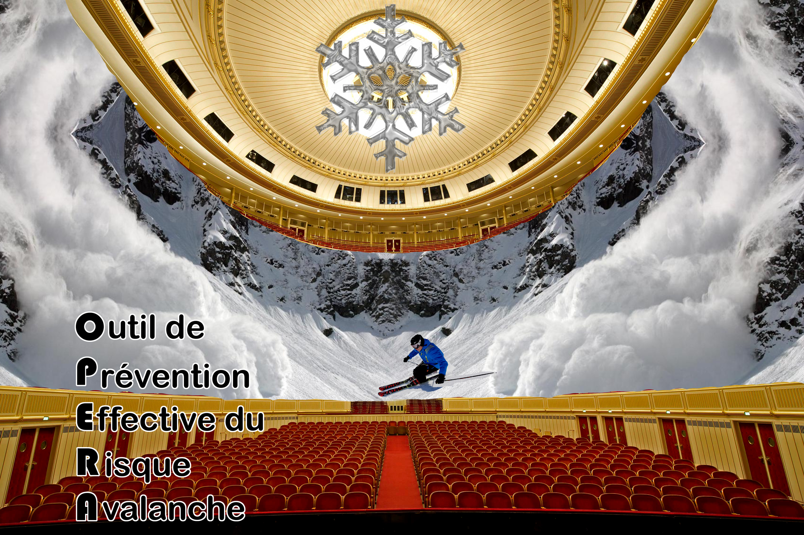

# OPERA

Outil de Prévision Effective du Risque Avalanche

Projet développement de 2e année
Henri Debray, Iris de Gélis, Amaury Zarzelli

## Besoins
+ Un outil d'aide à la décision
+ Un démonstrateur du lien entre information géographique et nivologique

## Outil
+ Plugin QGIS Python
+ Données en entrée : MNT et délimitation des massifs

## Vidéo de présentation
(à venir)

## Perspectives
+ Prise en compte des pentes surplombant chaque point
+ Consultation d'expert pour la sémiologie